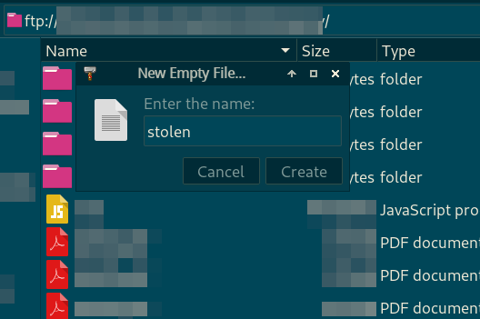
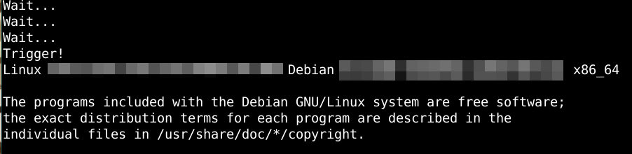
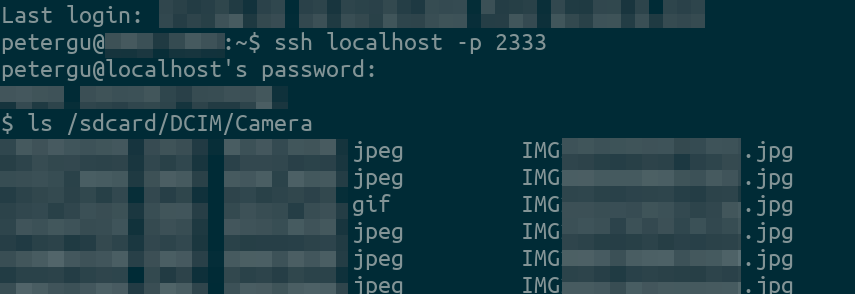
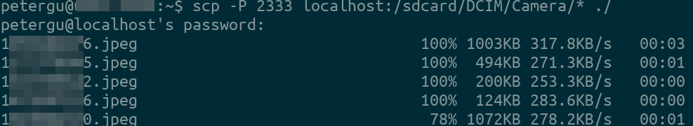

# termux-reverse-ssh (trs)
Make Android phone accessible from a public server via reverse SSH tunnel. Root NOT needed.  

### Requirements & Function

You need a server accessible via SSH in public network, and an URL you can control to be valid or invalid. 

trs will check whether a URL is accessible every 30 minutes. The URL is normally invalid and if it becomes valid, trs will be triggered and open a reverse SSH tunnel to a remote server, from which the phone's Termux SSH can be accessed aka phone can be remote controlled. 

### Installation

Install Termux and Termux:Boot. Launch Termux:Boot once. 

Setup ssh and sshd in Termux. Then run install.sh in Termux. You'll be prompted for server and  trigger URL information. 

If everything works fine, trs will auto-launch on device startup. 

### Example usage

*After your phone is stole... And if it isn't turned off...*

**Prepare the trigger URL**

(Here it's by creating a file on an FTP/HTTP site -- a 404 URL becomes valid)

**Reverse SSH tunnel will start after at most 30min**

(It's a debugging picture, you won't see this, of course)

**Connect to the server and access the phone, now in Termux: where there is a shell, there is a way**

**Photos being backed-up via `scp`: speed is not bad!**

### Others 

**NO WARRANTY**

Read the source code for detailed usage. It's shorter than this README. 

Security is not guaranteed. SSH private key is on phone. 

I don't want to be "logged-in" to the server all the time, so didn't make an always-alive connection. 

You shouldn't rely this on data protection. Backup regularly instead. 

